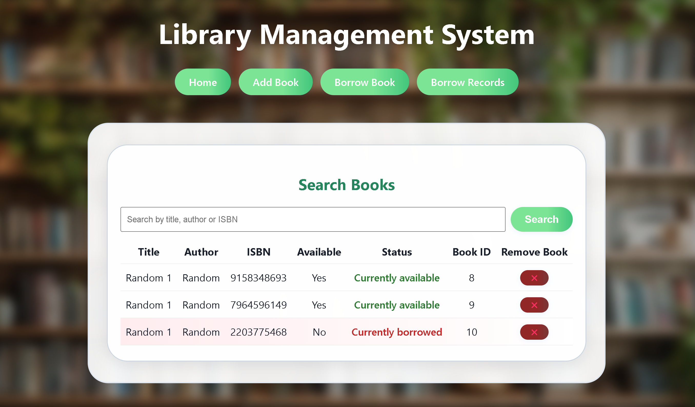
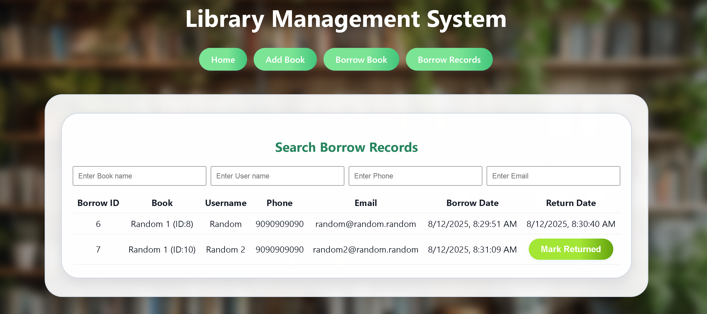

# Library Management System

A modern, full-stack Library Management System built with React (frontend) and Spring Boot (backend).

## Features

- **Book Management**: Add, search, view, and remove books with details (title, author, ISBN, availability).
- **User Management**: Create and manage users automatically when borrowing books.
- **Borrow & Return**: Borrow and return books with real-time status updates and borrowing history.
- **Records**: View and filter all borrow records, including overdue status.
- **Search**: Powerful search for books and records by multiple fields.
- **Modern UI**: Clean, responsive, and user-friendly interface with beautiful background and blur effects.

## Tech Stack

- **Frontend**: React, Vite, CSS
- **Backend**: Spring Boot, Java, JPA/Hibernate
- **Database**: MySQL

## Getting Started

### Prerequisites
- Node.js & npm
- Java 21+
- MySQL (running on `localhost:3306` with a `librarydb` database)

### Setup

#### 1. Clone the repository
```sh
git clone https://github.com/md-hzs-22/Library-Management-System.git
cd Library-Management-System
```

#### 2. Backend Setup
- Configure your MySQL credentials in `backend/src/main/resources/application.properties`:
  ```properties
  spring.datasource.url=jdbc:mysql://localhost:3306/librarydb?useSSL=false&allowPublicKeyRetrieval=true&serverTimezone=UTC
  spring.datasource.username=YOUR_USERNAME
  spring.datasource.password=YOUR_PASSWORD
  spring.datasource.driver-class-name=com.mysql.cj.jdbc.Driver
  ```
- Install dependencies and run the backend:
  ```sh
  cd backend
  mvn clean install
  mvn spring-boot:run
  ```

#### 3. Frontend Setup
- Install dependencies and run the frontend:
  ```sh
  cd ../frontend
  npm install
  npm run dev
  ```
- The app will be available at [http://localhost:5173](http://localhost:5173)

## Usage
- **Landing Page**: Welcome and overview
- **Home**: Search, view, and manage books
- **Add Book**: Add new books
- **Borrow**: Borrow books (auto-creates user if needed)
- **Records**: View and return borrowed books

## Screenshots

Home Page:



Borrow Records:



## Project Structure

Your project structure should look like this : 
```
Library-Management-System/
├── backend/         # Spring Boot backend
├── frontend/        # React frontend
└── README.md
```

---

